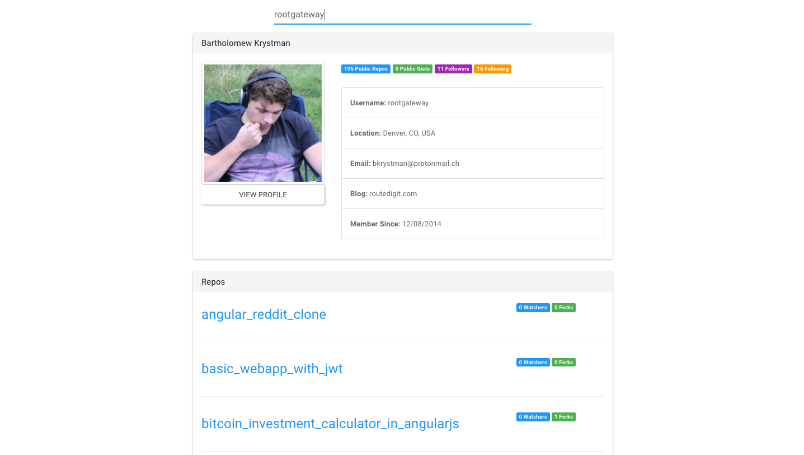

# <a href="https://www.routedigit.com">RouteDigit.com</a> - Mini Project
### Title: Git Localizer

<strong>Screenshot:</strong>
 

<strong>Project Story:</strong>
 
A programmer finds out that his best friend is using github for his projects. He know his friends username account name and decides to create Angular 2 application to check his friends account information and some of his repos.

<strong>Project Description:</strong>
 
This is a simple Angular 2 project combined with Express. Based on search criteria you are able to display github user information and repos. In this project we are using Bootstrap for our styling and Angular 2. The search data is connected to github api and brought over through Angular 2 all the way to our user interface.

<strong>App Type:</strong> Angular 2 WebApplication

<strong>Technologies Used:</strong>
 
TypeScript, ThirdPartyApi, Express, Angular2, HTML, CSS, Bootstrap, Heroku.

<strong>YouTube:</strong> <a href="http://www.youtube.com/watch?v=QsV45g9mrC8">http://www.youtube.com/watch?v=QsV45g9mrC8</a>

<strong>Deployed Link:</strong> <a href="https://rd-git-localizer.herokuapp.com">https://rd-git-localizer.herokuapp.com</a>
